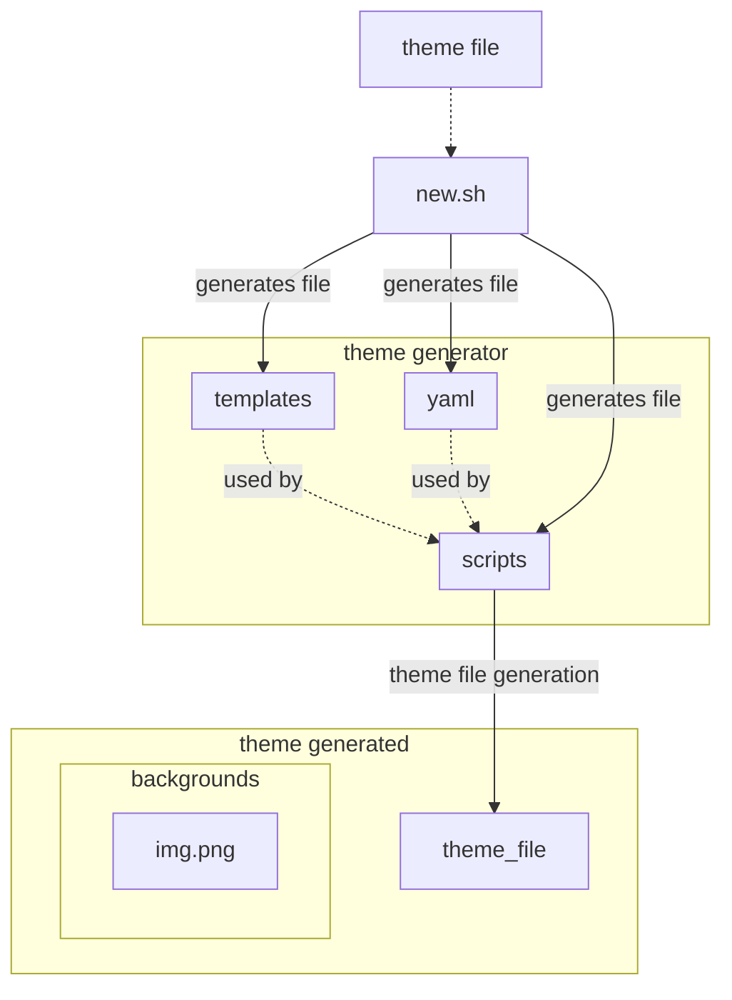

# ThemeCooker

ThemeCooker or Theme Cooker, es una app que se me ha ocurrido para semi-auto-generar themes para omarchy, en base a 
backgrounds que se pasen como input para el theme.

Debemos partir de un template theme y luego afinar hacia lo que queremos conseguir.

# Setup

I am going to give a try to UV python from astral.

## Install
```bash
pip install .
```

## Theme generator
I am trying to automate the theme creation taking images and extracting color schemes.

I want to later use those color schemes to generate a theme using templates, taking input data from yaml and using python to process that.

