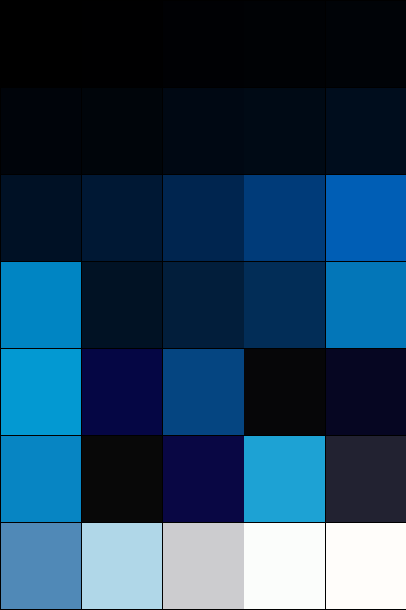

# 🍳 ThemeCooker

CLI toolkit to **generate full visual themes** for Omarchy and similar Linux environments.  
Automates everything: extract → prepare → build.

You simply need to prepare a folder with new backgrounds, then the program will extract a color palette from them and 
all the files for the theme will be created.

---

## Installation

Clone this repository, so you should be inside your `ThemeCooker` directory.
```commandline
pip install .
```
`ThemeCooker` installs as a python package, giving you the following commands (and workflow).

## Usage
### theme-template
Copy a theme configuration `template_configuration.yaml` to your working directory

command:
```commandline
theme-template
```
output:
```terminaloutput
✅ ️'/home/daiego/ThinThought/ThemeCooker/template_configuration.yaml' Already present
```
### theme-extract
This command will extract a 37 colors to elaborate a palette in a resulting `colors_extracted.yaml`.

command:
```commandline
theme-extract
```
output:
```terminaloutput
🎨 Processing img.png
🎨 Processing img_1.png
🎨 Processing img_3.png
🎨 Processing img_4.png
🎨 Processing img_5.png
🎨 Processing img_6.png
🎨 Processing img_7.png
🎨 Processing img_8.png
✅ Extracted 37 colors → /home/daiego/ThinThought/ThemeCooker/colors_extracted.yaml
```

### theme-preview
You can preview this palette with:
```commandline
theme-preview colors_extracted.yaml
```
this will generate a `palette_preview.png` like this:



## theme-gen
Finally generate an Omarchy theme with your fresh configuration with colors
```commandline
theme-gen example_theme
```

The theme generated will have your images as backgrounds and the following structure:
```terminaloutput
example
├── alacritty.toml
├── backgrounds
│   ├── img_1.png
│   ├── img_2.png
          |     ...
│   └── img_n.png
|
|  ... more configuration files
```
I based the structure of the generation on the files found in the theme tokyonight, from it , I structured the templates 
in the generator.

---

## 🧱 Built For

* Omarchy & Hyprland setups
* Fast theme prototyping

---
"Idk, I thought it would be funny to automatically generate an Omarchy theme. I love the vibe I went through making this"

**Daiego43 / ThinThought — 2025**

